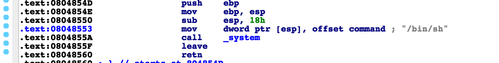
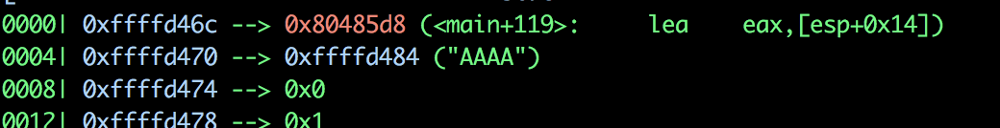
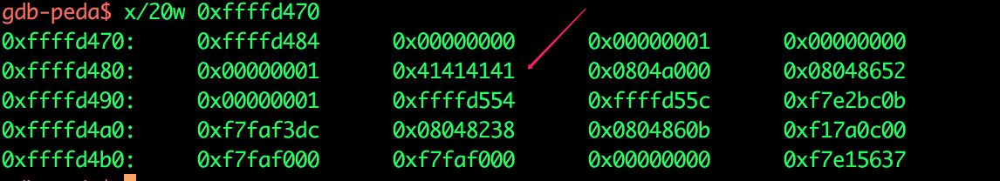
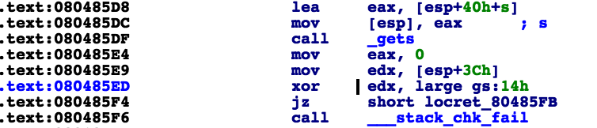
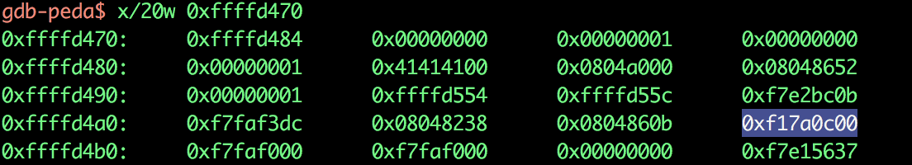
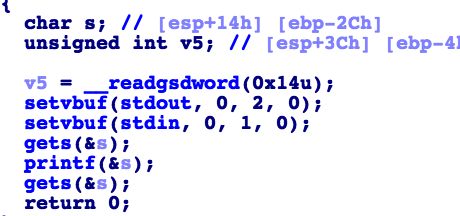
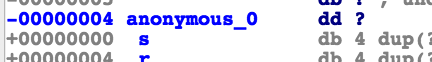
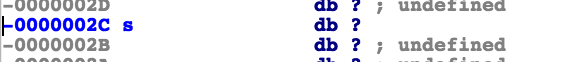
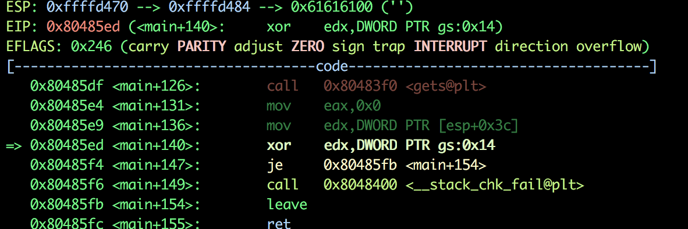

解题思路

找到system地址,0x08048553

system('/bin/sh')

泄露canary的值，以及与printf的偏移地址

从0xffffd470开始，偏移为5

覆盖canary的值，这个canary的值是mian函数产生的，先覆盖缓冲区开头到canary的值，然后覆盖canary到ebp的值，后面就跟着返回system返回地址

启用GS选项之后，会在函数执行一开始先往栈上保存一个数据，等函数返回时候检查这个数据，若不一致则为被覆盖，这样就跳转进入相应的处理过程，不再返回，因此shellcode也就无法被执行，这个值被称为“Security cookie”。

在xor这里下断点，0x080485ED

看到canary的偏移为15，printf(%15$x')

计算第一个gets与canary的偏移

因为canary的赋值是从v5而来所以这里计算s和v5的偏移

0x2c-0x04=40

双击变量

计算canary值的地址 p/x 0xffffd470+0x3c = 0xffffd4ac

EBP: 0xffffd4b8

计算canary 到 存放ebp的地址的长度

p/d 0xffffd4b8 - 0xffffd4ac =12

问题：

printf为什么会有偏移？

还有什么别的方法计算第一个gets到canary的偏移

payload